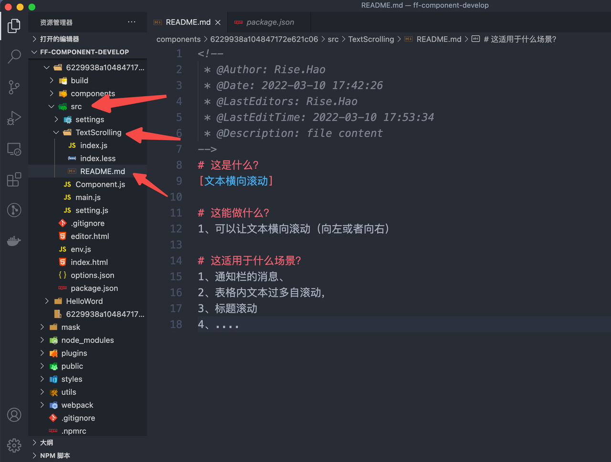

# 组件开发规范

## 一、开发前准备

1. 基础技术栈了解。[React](https://reactjs.org/)、[Less](https://less.bootcss.com/)、[Webpack](https://webpack.docschina.org/)、[JQuery](https://jquery.cuishifeng.cn/index.html)。
2. 熟悉组件构成。详细见[组件基础](http://docs.aiops.cloudwise.com/zh/flyfish/component/basic.html)。
3. 熟悉组件之间事件交互。详细见[组件事件](http://docs.aiops.cloudwise.com/zh/flyfish/component/event.html)。
4. 需要安装`node`. 推荐版本`14.x`。

## 二、开发规范

### 1、遵循统一目录结构

```Shell
├── build
│   ├── webpack.config.dev.js
│   └── webpack.config.production.js
├── editor.html.js
├── env.js
├── options.json.js
├── package.json.js
├── option.json
└── src
    ├── ComponentJs.js
    ├── ComponentJsForHt.js
    ├── data.js
    ├── mainJs.js
    ├── options.js
    └── setting.js
```

option 结构

```JSON
{
  "key": "value"
}
```

### 2、组件目录结构规范

> 一定要建成文件夹形式和 Component.js 同级存放，方便以后的拆分和组合

- 命名要用大驼峰命令法。
- 所有资源，都要放到同一个文件夹下。
- 如果组件内代码量比较复杂的，建议 index.js 只是一个容器，用来引用其他文件。
- 默认文件规定是 index，否则不看你的 component 根本不知道那个是根目录。


### 3、默认值

- 若组件为数据驱动的组件, 务必要在组件或包裹组件内添加`getDefaultData`函数来为组件指定默认数据返回函数。

```JavaScript
'use strict';
import BaseComponent from "data-vi/ReactComponent";
import ScrollList from "./ScrollList/index.js"
export default class ReactComponent extends BaseComponent {
  // 默认配置
  getDefaultConfig() {
    return {
      left: 534,
      top: 200,
      width: 441,
      height: 322,
      visible: true,
      name: '无限滚动列表',
    };
  }
  // 默认选项
  static defaultOptions = {
    defaultTheme: true, // 初始默认样式
    titleRender: `function(dataIndex, value, setEvent) { return value; }`,
  };
  // 系统事件
  static events = {};
  // 是否加载css文件 如当前组件没有样式文件，设置为false
  static enableLoadCssFile = true;
  //默认数据
  getDefaultData() {
    return {
      //写在代码里的静态数据源
      dataSource: [
        {
          title: '这是 FF 评价设计好坏的内在标准。基于「每个人都追求快乐工作」这一假定，我们在「确定性」和「自然」的基础上',
          number: '数值1',
        },
        {
          title: '标题1',
          number: '数值2',
        },
      ],
    };
  }
  getReactComponent() {
    return ScrollList;
  }
}
```

- 要对数据做相应的判空和结构初始化处理。避免层级过深数据格式在错误格式下导致组件瘫痪事件发生。

```JavaScript
imprt React, { Component } from 'react';
import ReactComponent from 'data-vi/ReactComponent';

// 正常的react组件
class MyComponent extends Component {
  computedDisplayMessage = () => {
    // 1. 解构算是一种比较常用的默认值方式
    const [
      data: {
        alarm: {
          message = ''
        } = {}
      } = {}
    ] = this.props.data || [];
    return message;

    // 2. 配合数据结构做基本检测
    const [ data ] = this.props.data || [];
    if (data && data.hasOwnProperty('alarm')) {
      return data.alarm.message;
    }

    // 3. 当然方法还有很多, 还可以借助babel-chaining来使用?.判空操作符来处理。
  }

  render() {
    return (
      // your jsx
    )
  }
}

// 导出由data-vi包裹可用的React组件
export default class WrapperMyComponent extends ReactComponent {
  getDefaultData() {
    // 这里的层级是为了演示
    return [
      {
        data: {
          alarm: {
            message: 'finally display message'
          }
        }
      }
    ]
  }
  getReactComponent() {
    return MyComponent;
  }
}
```

### 3、代码语义化、有注释、容易阅读和理解

> 比如 Class 组件 render 里面写了好多的变量循环，还是建议拆分出 render,毕竟 render 一次就会计算一次的，一些方法逻辑在 render 里造成不必要出发，尤其是 render 中只用 map 等一些循环，次次触发 render 造成不必要性能损耗，建议写在生命周期中，为了可观度方法也不建议在 render 中声明。

```javascript
import React, { useMemo } from "react";
import "./index.less";

const ScrollList = ({ data }) => {
  const { dataSource = [] } = data || {};
  const scrollingNumber = 10; //每行展示条数
  const statusLenght = dataSource.length < scrollingNumber; //不满足展示条数不滚动

  /**
   * 处理数据
   */
  const newdataSource = useMemo(() => {
    //数据没有超过一屏则不需要滚动
    if (statusLenght) return [dataSource];
    //为了实现无缝滚动必须让数据 * 2
    return [dataSource, dataSource];
  }, [dataSource, statusLenght]);

  return (
    //为了避免样式全局污染以及方便寻找按照飞鱼的组件样式定义：开头：ff-components，组件名：scrollist，组件ID：622742cf230821173ac3898d
    <div className="ff-components-scrollist-622742cf230821173ac3898d">
      {
        //两次数据滚动
        (newdataSource || []).map((_item, _index) => {
          return (
            <div
              key={`scrolList${_index}`}
              className={`scrolList ${!statusLenght && "scrolListAnimation"}`}
            >
              {(_item || []).map((item, index) => {
                //每一行展示的数据
                return (
                  <div key={`list${index}`} className="text">
                    <p>{item.title}</p>
                    <p>{item.status}</p>
                    <p>{item.number}</p>
                  </div>
                );
              })}
            </div>
          );
        })
      }
    </div>
  );
};
export default ScrollList;
```

### 4、在组件源码文件夹内含有 REREADME.md



```markdown
# 这是什么？

[文本横向滚动]

# 这能做什么？

1、可以让文本横向滚动（向左或者向右）

# 这适用于什么场景？

1、通知栏的消息、
2、表格内文本过多自滚动，
3、标题滚动
4、....

# 版本号

​```javascript 
{ 
  "echarts": "5.3.1",
  "echarts-for-react": "3.0.2"
} 
​``` 
# 默认数据
​```javascript 
{ 
  dataSource: [ 
    { 
      title: '这是 FF 评价设计好坏的内在标准。基于「每个人都追求快乐工作」这一假定，我们在「确定性」和「自然」的基础上', 
      number: '数值1', 
    }, 
    { 
      title: '标题1', 
      number: '数值2', 
    }, 
  ]
} 
​```
```

### 5、版本号规定

> 统一常用依赖版本号，降低因同一依赖不同版本而产生的额外工作量

```json
{
  "echarts": "5.3.1",
  "echarts-for-react": "3.0.2"
}
```

### 6、自适应

由于我们的组件在拖拽过程中会根据当前的大小来自适应样式(你可以理解成每个组件就是一个独立的页面, 它们的大小受限于窗体大小).

所以在开发过程中尽量可以避免使用定值尺寸, 比如矢量大小可以采用百分比或者 vw/h 布局来达到标准自适应。

此外, 如果需要获取几何大小或者监听当前的缩放行为, 可以使用事件机制。如下:

```JavaScript
// 省略部分依赖
class MyComponent extends Component {
  constructor(props) {
    super(props);

    this.addEventListener();
  }

  addEventListener = () => {
    const eventBus = this.props.parent;
    // 这里用最常用的reised来举个例子
    eventBus.bind('resized', ({ width, height }) => {
      // do your resized code
    });
  };

  // 省略无关代码
}

export default class WrapperMyComponent extends ReactComponent {
  static events = {
    resized({ width, height }) {
      // do something for resize
    },
  };
}
```

### 7、setting

设置面板一方面是更显式的展示出我们组件的能力。另一方面方便使用者在编辑大屏时进行客制化。所以大家在编辑至少遵循一下几点:

```JavaScript
// options.js
export default class OptionsSetting extends ComponentOptionsSetting {
  // 可自定义样式: 若您在设置面板中书写样式会抽离出setting.css.
  // 显式的将以下属性设置为true可告知飞鱼来加载您的样式文件
  enableLoadCssFile = true;
}
// 显式属性名称、描述

// 省略部分依赖

export default class SettingBoard extends Component {
  render() {
    return (
      <Form>
        // 无分组平铺类型
        <FormItem label="propsA" extra="description of propsA">
          // your coding
        </FormItem>
        // 有分组式
        <FormItemGroup title="group title">
          <FormItem label="groupPropsA" extra="description of groupPropsA">
            // your coding
          </FormItem>
        </FormItemGroup>
      </Form>
    );
  }
}
group和普通的item区别为内部的item会自动左右布局。所以可以考虑对应的props长度。
```

1. 默认属性 保证默认属性清晰。且提供的交互方式便捷。
2. 自定义属性 保证属性的可覆盖可扩展。比如在开发图标的过程中, 部分复杂属性配置不可枚举, 推荐留下自定义属性配置并将其优先级提至不影响组件正常功能的前提下为最高。覆盖面广。可让二次开发者编辑扩展能力。
3. 此外我们提供[chart-panel](http://10.2.2.38/-/web/detail/@cloudwise-fe/chart-panel)封装了大部分`ehcarts`图表配置。以及提供了部分公共组件: 如多个数字输入框、代码弹窗、预览弹窗、渐变色等. 风格为`ant4.x`. 具体使用方式可参考`README`.

### 8、事件机制

切莫滥用事件机制, 并保证在组件销毁的时候对应的取消事件订阅。

### 9、样式隔离

一定要做样式隔离，避免样式全局污染以及方便
```SCSS
//方便使用定义成了一个变量和在html那边的名字一致 组件名字 + 组件ID
@prefixCls: ff-components-scrollist-622742cf230821173ac3898d; 

//变量方便使用
.@{prefixCls} {
  display: flex;
  flex-direction: column;
  border: #fff 2px solid;
  padding: 10px;
  box-sizing: border-box;
  width: 100%;
  height: 420px;
  overflow: hidden;
  .scrolList {
    .text {
      display: flex;
      justify-content: space-between;
      color: #fff;
      height: 40px;
      line-height: 40px;
    }
  }
  .scrolListAnimation {
    animation: 10s wordsLoop linear infinite normal;
  }
  @keyframes wordsLoop {
    0% {
      transform: translateY(0px);
      -webkit-transform: translateY(0px);
    }
    100% {
      transform: translateY(-100%);
      -webkit-transform: translateY(-100%);
    }
  }
}
//鼠标经过停止
.@{prefixCls} :hover .scrolList {
  animation-play-state: paused;
}
```

### 10、组件兼容

1）组件开发后需在常用浏览器Chrome、Firefox、Safari、360、IE等进行试运行自测；

2）antd使用中建议版本：4.16.12；版本过高可能存在兼容问题；

3）拓扑图组件中注意在大屏五种缩放模式下自适应，禁止缩放后节点捕获错位情况！！！

### 11、组件动效
对于非持续性（不是一直循环）动效，应让整个动效过程表现得柔和些，不能太直白，如设置keyframes时，不仅要设置头和尾，还要在中间设置过渡，符合人眼对于物体运动的判断。
```CSS
//例如：
@keyframes rotate {
    0% {
        transform: rotate(0);
    };
    100% {
        transform: rotate(360deg);
    }
  }
  .scrolListAnimation {
    animation: 10s wordsLoop linear infinite normal;
  }
  @keyframes wordsLoop {
    0% {
      transform: translateY(0px);
      -webkit-transform: translateY(0px);
    }
    100% {
      transform: translateY(-100%);
      -webkit-transform: translateY(-100%);
    }
  }
}
//鼠标经过停止
.@{prefixCls} :hover .scrolList {
  animation-play-state: paused;
}
```
让转动效果在一开始有个加速的过程，结束时有个减速的过程，更加符合人眼对于速度的预期，而不是一开始就达到最大的速度。
