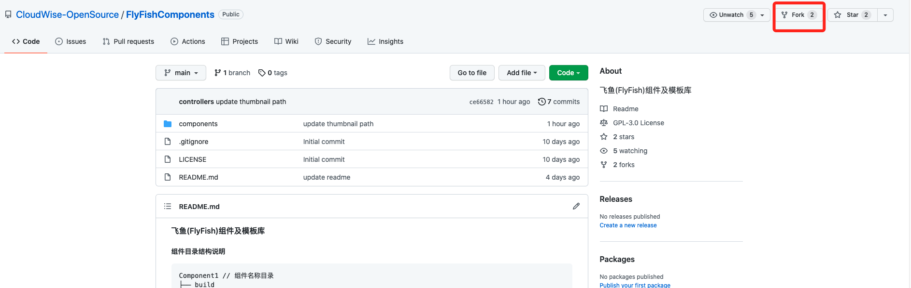
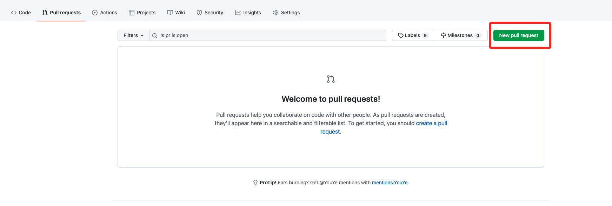

## 组件上传代码库

#### 1、访问[组件库](https://github.com/CloudWise-OpenSource/FlyFishComponents)，Fork 一下



#### 2、clone Fork 的库到本地

```
git clone Fork库地址
```

#### 2、将下载的组件包放置到 components 文件夹下

添加组件引导 describe.json 到添加的组件目录下，文件格式如下：

```json
{
  "compName": "组件名称",
  "compType": "组件类别",
  "contributor": "组件贡献者",
  "description": "组件描述",
  "publicTime": "贡献时间"
}
```

#### 3、提交代码，之后提 PR 合并至代码库


